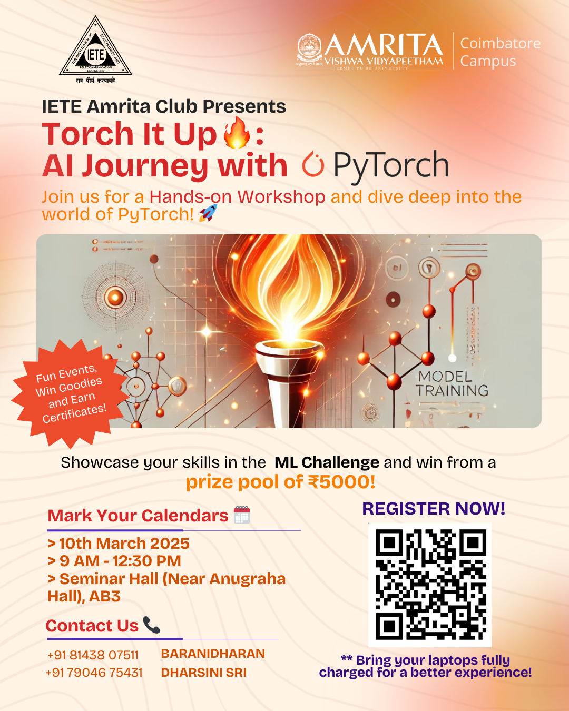

# 🔥 Torch It Up: An AI Journey with PyTorch  
**Organized by IETE Amrita Club**

Welcome to the official repository for **"Torch It Up"**, a beginner-friendly AI workshop hosted by **IETE Amrita Club**, where we dived into the foundations of **PyTorch** and explored how to build machine learning models using this powerful framework.

---

## 📚 What’s Inside?

This repository contains the resources used during the session:

- 📓 **Jupyter Notebooks**: Step-by-step PyTorch tutorials and example models covered during the session.
- 📽 **Presentation Slides**: A downloadable PDF of the session's PPT used to walk through the concepts.

---

## 🚀 What Did We Cover?

- Introduction to AI & Deep Learning  
- Basics of PyTorch (Tensors, Autograd, Modules, etc.)  
- Building a simple ML model from scratch using PyTorch  
- Hands-on coding walkthrough with real-time demos  

---

## 🏆 ML Challenge

To make your learning exciting, we hosted an **exclusive Machine Learning Challenge** with a **prize pool of ₹5000** on **Kaggle**!  
Only participants registered for our event will be considered for this challenge.

👉 **Challenge Link:** [Torch It Up ML Challenge on Kaggle](https://www.kaggle.com/t/480b72c184ae483a9b0d2e362817f2d2)

📌 _Note: The challenge is accessible only to the registered participants of the event._

### 📥 Submission Instructions:
Once you've made your submission on Kaggle, **you must also fill out the following form** to officially be considered for evaluation.

🔗 **Final Submission Form:**  
[https://forms.office.com/r/QYnfRmT13Q](https://forms.office.com/r/QYnfRmT13Q)

Please include:
- ✅ Your **team details** (team name, members)
- ✅ A short **methodology/approach summary**
- ✅ Upload your **.ipynb notebook file** used in the challenge

📢 _Submissions without the form will not be eligible for evaluation, even if submitted on Kaggle._

---

## 🔗 Stay Connected with IETE Amrita!

Check out our website and follow us for updates:

- 🌐 Website: [https://avvsf.ietecbe.org/](https://avvsf.ietecbe.org/)  
- 📸 Instagram: [https://www.instagram.com/iete_amrita/](https://www.instagram.com/iete_amrita/)  
- 💬 WhatsApp Community: [Join Here](https://chat.whatsapp.com/EaQtTt7U4ClKEz26g9ddii)  
- 💻 GitHub: [https://github.com/IETEAmritaChapter](https://github.com/IETEAmritaChapter)

---

## 🙌 Acknowledgements

Huge thanks to all the 250+ participants who made this event a success!  
Special shoutout to our presenters, organizing team and faculty advisors who made this learning journey smooth and fun 🎉

---

Happy Learning! 💡  
_Keep experimenting. Keep torching it up with PyTorch!_
